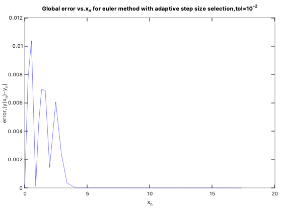

# MTL712-Computational-Methods-for-DEs
MATLAB codes for the course MTL712

### Adaptive Step Size Selection  
1. Plot for step size vs x for Euler method:  

Note that the second derivative of y in LTE(Local Truncation error) is approximated using the following:  
   

   tol = 1e-2    

   tol = 1e-4

2. Plot for Global error vs. x for Euler method:

   tol = 1e-2

   tol = 1e-4

   both the tolerances on the same plot

3. Step size vs. x for trapezoidal method
   Approximate third derivative of y_n using the following:  
    

   tol = 1e-2
   

   tol = 1e-4
   

4. Global error vs. x for trapezoidal method

   tol = 1e-2
   

   tol = 1e-4
   

   both the tolerances on the same plot
   